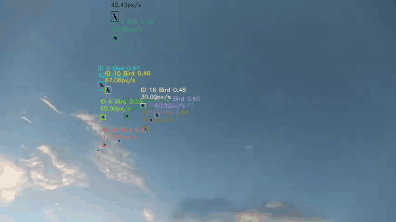
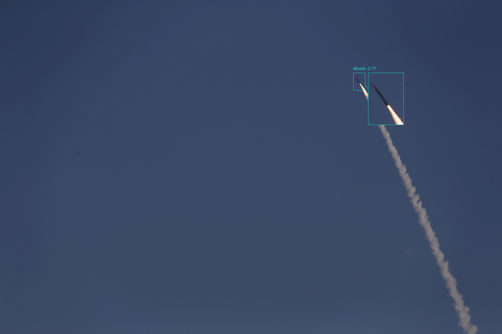
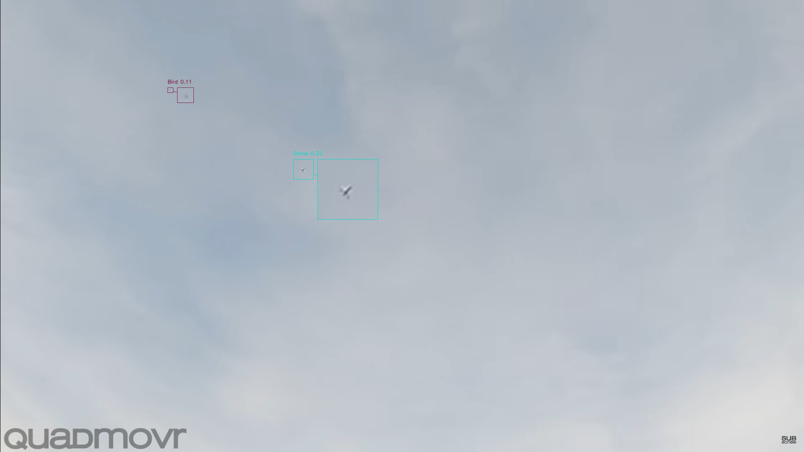
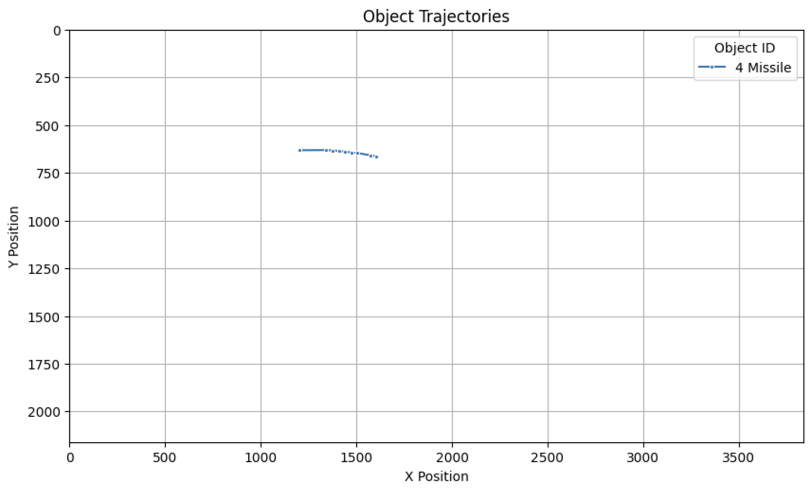
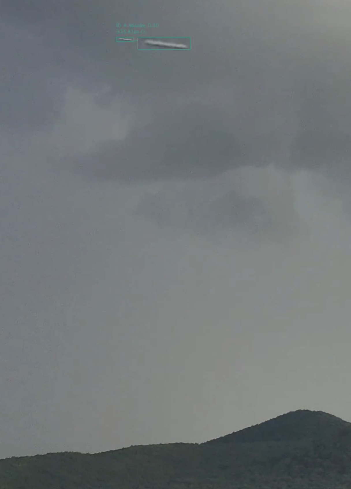
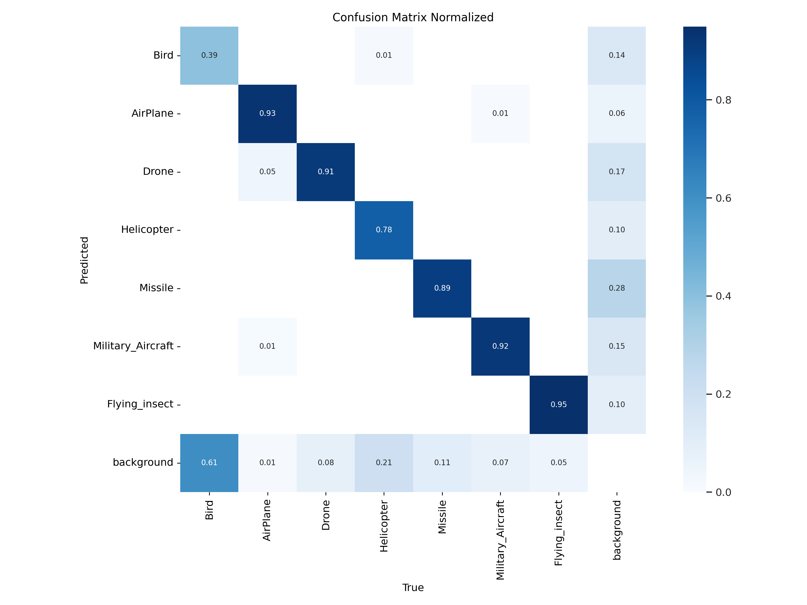
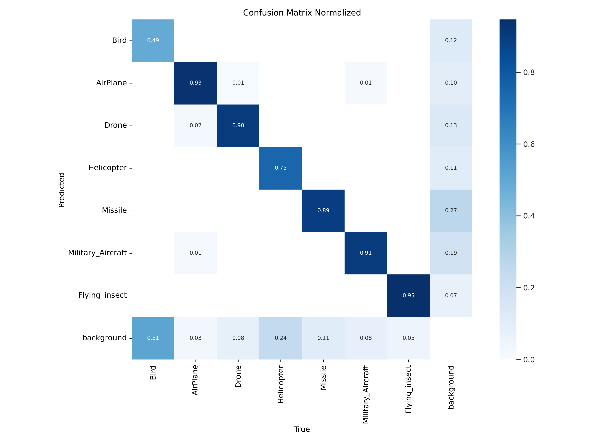
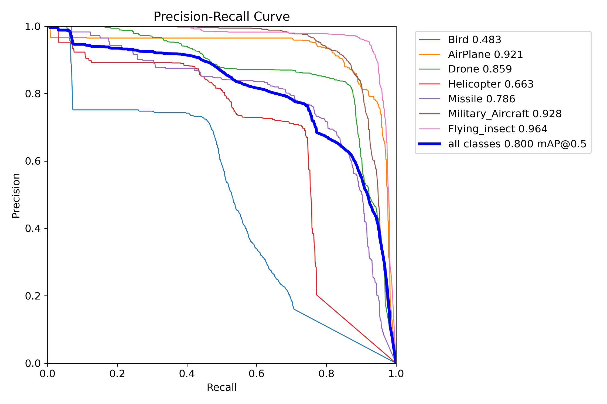
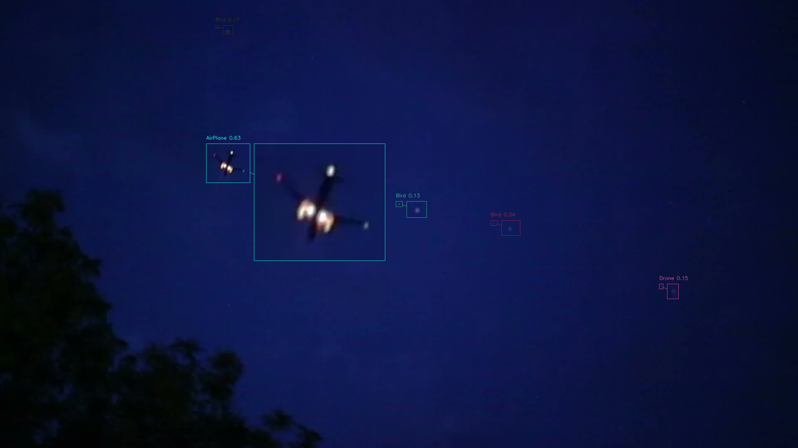

<div align="center">
<h1>
  
</h1>

<h1 align="center">Aerial object detector and tracker</h1> 



<p align="center">
  <a href="#key-features">Key Features</a> •
  <a href="#installation">Installation</a> •
  <a href="#basic-usage">Basic usage</a> •
  <a href="#training-and-evaluation-results">Training and evaluation results</a>  •
  <a href="#limitations">Limitations</a> 
  <br>
  <a href="#parameters">Parameters</a> •
  <a href="#datasets">Datasets</a> •
  <a href="#license">License</a>
</p>

<!---
<div>
  <br>
    <a href="TODO"></a>

</div>
--->
</div>


## <div align="center">Overview</div>

Detecting small flying objects, such as drones, birds or other flying objects, is a significant challenge in fields like security, wildlife monitoring, and airspace management. These objects often move quickly, are difficult to detect due to their size, and may blend into complex backgrounds, making traditional object detection methods less effective. 

The current version of the project addresses these challenges by utilizing <a href="https://docs.ultralytics.com/" target="_blank">YOLO</a> (You Only Look Once) models fine tuned for aerial object detection, combined with the <a href="https://github.com/obss/sahi" target="_blank">SAHI</a> (Slicing Aided Hyper Inference) framework. SAHI enhances the detection capabilities by slicing images or video frames into smaller patches, allowing for more precise identification of small and fast-moving objects. 

Moreover, this library comes with a custom tracker and many parameters that help filtering the kind of objects that the user is looking for.

<div align="center">
    
    <br />
    
    <br />
    
    <br />
    
    <br />
    
    <br />
    
</div>

## Key Features

* Fine-tuned models specialized in flying object detection are provided.
* Classification classes: Bird, Airplane, Drone, Helicopter, Missile, Military aircraft, Flying insect.
* Allows detection on single images or videos.
* Includes a custom tracker to obtain object trajectories.
* Many customizable parameters such as expected area filter, minimum velocity filter, etc.
* Provides a report with images and CSV of detected objects and trajectories that enables a subsequent video analysis.
* Video generation with detections and customizable visualization (traces and zoom).
* Compatible with YOLO models.
* Pipeline with customizable SAHI.

You can explore the demo notebook <a href="demo.ipynb" target="_blank">here</a>.

## Installation

Ensure you have the following installed:

- Python 3.8.10+
- pip

> It is highly recommended to use a GPU to accelerate processing.

```bash
# Clone this repository
git clone https://gitlab.com/cambrian_intelligence/tracking_cielo.git
```

```bash
# Go into the repository
cd tracking_cielo
```

```bash
# Install dependencies
pip install -r requirements.txt
```

## Basic usage

The following command processes the video with the default parameters and model and generates an ``output`` folder with the detected video, cvs with the results and image of the trajectories.


```bash
python src/detector.py --source_path SOURCE_PATH
```

## Training and evaluation results

We have trained two models with different input sizes (640 and 1280) that are available in the `models` folder. We trained these models on a dataset of images of different flying objects at different scales and distances.

In our case, the bird images consist mainly of large images with very distant birds, so this class is by far the most difficult to learn, as can be seen from the metrics of the test set.

All following results are computed without using SAHI.

### 640 Model

<div align="center">

| Class             | metrics/precision(B) | metrics/recall(B) | metrics/mAP50(B) | metrics/mAP50-95(B) |
|-------------------|----------------------|-------------------|------------------|---------------------|
| all               | 0.830                | 0.797             | 0.807            | 0.520               |
| Bird              | 0.757                | 0.350             | 0.390            | 0.152               |
| AirPlane          | 0.919                | 0.923             | 0.948            | 0.640               |
| Drone             | 0.830                | 0.872             | 0.852            | 0.475               |
| Helicopter        | 0.759                | 0.742             | 0.744            | 0.504               |
| Missile           | 0.709                | 0.845             | 0.806            | 0.453               |
| Military_Aircraft | 0.907                | 0.914             | 0.952            | 0.824               |
| Flying_insect     | 0.931                | 0.933             | 0.953            | 0.591               |
</div>

<div align="center">
    
    
</div>


### 1280 Model
<div align="center">

| Class             | metrics/precision(B) | metrics/recall(B) | metrics/mAP50(B) | metrics/mAP50-95(B) |
|-------------------|----------------------|-------------------|------------------|---------------------|
| all               | 0.773                | 0.804             | 0.800            | 0.479               |
| Bird              | 0.738                | 0.408             | 0.483            | 0.183               |
| AirPlane          | 0.795                | 0.921             | 0.921            | 0.520               |
| Drone             | 0.832                | 0.858             | 0.859            | 0.473               |
| Helicopter        | 0.690                | 0.738             | 0.663            | 0.376               |
| Missile           | 0.618                | 0.865             | 0.786            | 0.426               |
| Military_Aircraft | 0.825                | 0.901             | 0.928            | 0.747               |
| Flying_insect     | 0.914                | 0.941             | 0.964            | 0.629               |
</div>

<div align="center">
    
    
</div>

### Class agnostic evaluation

Using COCO-evaluator to analyze the ability to detect objects:

<div align="center">

| **Metric**                                   | **IoU**         | **Area**   | **Max Detections** | **Model_640** | **Model_1280** |
|----------------------------------------------|-----------------|------------|--------------------|---------------|----------------|
| Average Precision (AP)                       | 0.50:0.95       | All        | 100                | 0.421         | 0.412          |
| Average Precision (AP)                       | 0.50            | All        | 100                | 0.696         | 0.721          |
| Average Precision (AP)                       | 0.75            | All        | 100                | 0.411         | 0.388          |
| Average Precision (AP)                       | 0.50:0.95       | Small      | 100                | 0.230         | 0.263          |
| Average Precision (AP)                       | 0.50:0.95       | Medium     | 100                | 0.429         | 0.454          |
| Average Precision (AP)                       | 0.50:0.95       | Large      | 100                | 0.661         | 0.553          |
| Average Recall (AR)                          | 0.50:0.95       | All        | 1                  | 0.362         | 0.362          |
| Average Recall (AR)                          | 0.50:0.95       | All        | 10                 | 0.481         | 0.494          |
| Average Recall (AR)                          | 0.50:0.95       | All        | 100                | 0.510         | 0.527          |
| Average Recall (AR)                          | 0.50:0.95       | Small      | 100                | 0.289         | 0.376          |
| Average Recall (AR)                          | 0.50:0.95       | Medium     | 100                | 0.553         | 0.569          |
| Average Recall (AR)                          | 0.50:0.95       | Large      | 100                | 0.736         | 0.663          |
</div>

## Limitations

The current framework has at least the following weaknesses:

* Difficulty detecting very small objects.

* Classification accuracy can be improved.

* The training dataset contains only daytime images; therefore, accuracy on nighttime images is worse than on daytime images.

<div align="center">
    
</div>


## Parameters

This section provides a detailed overview of the parameters available for processing a video and tracking objects using the SAHI tracker. You can use ``--help`` for more information.

<div align="center">

| Parameter              | Type    | Default            | Description                                                                                  |
|------------------------|---------|--------------------|----------------------------------------------------------------------------------------------|
| `--agnostic_nms`       | `bool`  | `True`             | Whether to use agnostic class Non-Maximum Suppression (NMS).                                 |
| `--area_thr`           | `tuple` | `(0, 0.01)`       | Tuple representing the area thresholds for filtering detections. This (min, max) filter discards bounding boxes whose area, as a percentage of the image area, is less than min or greater than max. Use (None, None) for no filter.                              |
| `--conf_thr`           | `float` | `0.1`              | Confidence threshold for object detection.                                                  |
| `--confirm_frames`     | `int`   | `5`                | Number of consecutive frames required to confirm the detection of an object.                |
| `-d, --device`         | `str`   | `'cuda:0'`         | Device to run the model on. Set this to `'cpu'` if a GPU is not available.                   |
| `-i, --iou_threshold`  | `float` | `0.1`              | Intersection Over Union (IOU) threshold for Non-Maximum Suppression.                        |                                   |
| `--max_class`          | `bool`  | `True`             | For each track, considers the class with the maximum number of occurrences.                 |
| `--max_disappeared`    | `int`   | `100`              | Maximum number of frames an object can disappear before being removed from tracking.         |
| `--max_distance`       | `int`   | `40`               | Maximum distance allowed for object tracking between frames, measured in pixels. Objects moving further than this distance may be considered as separate entities. |
| `--model_path`         | `str`   | `'models/model_640.pt'` | Path to the object detection model to be used for tracking.                                   |
| `-o, --output_folder`  | `str`   | `'output'`         | Directory where the output, including tracked videos, will be saved.  
| `--return_array`          | `bool`  | `False`            | When processing a single image, returns the image array.                        |
| `--sahi_overlap_ratio` | `Tuple` | `(0, 0)`           | Tuple indicating the overlap ratio `(height_overlap, width_overlap)` in terms of proportion (e.g., `0.2` for a window of size 512 produces an overlap of 102 pixels). |
| `--sahi_split`         | `Tuple` | `(None, None)`     | Specifies the number of divisions `(height_divisions, width_divisions)` for slicing the input into smaller windows. For example, `(2, 3)` splits the input into windows of size `H//2 x W//3`. Set to `None` to disable slicing. |
| `--sahi_verbose`       | `int`   | `0`                | Verbosity level for logging during sliced prediction. Higher values produce more detailed logs. |
| `--save_image`         | `bool`  | `True`             | When processing a single image, whether to save the output image in the output directory.    |
| `--source_path`        | `str`   | N/A                | Path to the input video or image file. This argument is required.                           |
| `--speed_threshold_factor` | `float` | `0.01`          | Factor to determine the speed threshold for filtering objects.                               |
| `-t, --trace`          | `bool`  | `False`            | Whether to draw traces of the objects' paths.                                               |
| `-z, --zoom`           | `bool`  | `True`             | Whether to zoom in on the detected objects in the output video.                              |

</div>

## Future steps

1. Refine the detection model.
1. Night sky.
1. Refine the implementation of the tracker and allow the use of other trackers.
1. Automatic parameter selection.
1. Handling moving cameras.
1. Re-evaluation of the detected class after computing the trace of the object.
1. Further analysis of object trajectories.
1. Develop additional datasets.

## Contact

Would you like to discuss with potential customizations of this software or related applications? 

Get in touch with us at info AT cambrianintelligence.com

<div align="center">
  <br /><br />
  
  <br /><br />
</div>


## Datasets

> **Title:** Flying Object Dataset  
> **Author:** new-workspace-0k81p  
> **Type:** Open Source Dataset  
> **Published in:** Roboflow Universe  
> **Publisher:** Roboflow  
> **Year:** 2022  
> **Month:** March  
> **License:** CC BY 4.0
> **URL:** [https://universe.roboflow.com/new-workspace-0k81p/flying_object_dataset](https://universe.roboflow.com/new-workspace-0k81p/flying_object_dataset)  

> **Title:** drone-detection-new Dataset  
> **Author:** AhmedMohsen  
> **Type:** Open Source Dataset  
> **Published in:** Roboflow Universe  
> **Publisher:** Roboflow  
> **Year:** 2022  
> **Month:** April
> **License:** MIT
> **URL:** [https://universe.roboflow.com/ahmedmohsen/drone-detection-new-peksv](https://universe.roboflow.com/ahmedmohsen/drone-detection-new-peksv)  

> **Title:** FINAL MISSILES Dataset  
> **Author:** qEDWdqw  
> **Type:** Open Source Dataset  
> **Published in:** Roboflow Universe  
> **Publisher:** Roboflow  
> **Year:** 2023  
> **Month:** January
> **License:** CC BY 4.0
> **URL:** [https://universe.roboflow.com/qedwdqw/final-missiles](https://universe.roboflow.com/qedwdqw/final-missiles)  

> **Title:** insectdetector Dataset  
> **Author:** detectorforinsects  
> **Type:** Open Source Dataset  
> **Published in:** Roboflow Universe  
> **Publisher:** Roboflow  
> **Year:** 2022  
> **Month:** August  
> **License:** CC BY 4.0
> **URL:** [https://universe.roboflow.com/detectorforinsects/insectdetector](https://universe.roboflow.com/detectorforinsects/insectdetector)  

> **Title:** Distant Bird Detection for Safe Drone Flight and Its Dataset  
> **Authors:** Sanae Fujii, Kazutoshi Akita, Norimichi Ukita  
> **Conference:** International Conference on Machine Vision Applications (MVA)  
> **Year:** 2021  
> **License:** MIT
> **URL:** [https://github.com/kakitamedia/drone_dataset](https://github.com/kakitamedia/drone_dataset)  

## License

MIT License

Copyright (c) 2024 Cambrian Intelligence

Permission is hereby granted, free of charge, to any person obtaining a copy
of this software and associated documentation files (the "Software"), to deal
in the Software without restriction, including without limitation the rights
to use, copy, modify, merge, publish, distribute, sublicense, and/or sell
copies of the Software, and to permit persons to whom the Software is
furnished to do so, subject to the following conditions:

The above copyright notice and this permission notice shall be included in all
copies or substantial portions of the Software.

THE SOFTWARE IS PROVIDED "AS IS", WITHOUT WARRANTY OF ANY KIND, EXPRESS OR
IMPLIED, INCLUDING BUT NOT LIMITED TO THE WARRANTIES OF MERCHANTABILITY,
FITNESS FOR A PARTICULAR PURPOSE AND NONINFRINGEMENT. IN NO EVENT SHALL THE
AUTHORS OR COPYRIGHT HOLDERS BE LIABLE FOR ANY CLAIM, DAMAGES OR OTHER
LIABILITY, WHETHER IN AN ACTION OF CONTRACT, TORT OR OTHERWISE, ARISING FROM,
OUT OF OR IN CONNECTION WITH THE SOFTWARE OR THE USE OR OTHER DEALINGS IN THE
SOFTWARE.

---